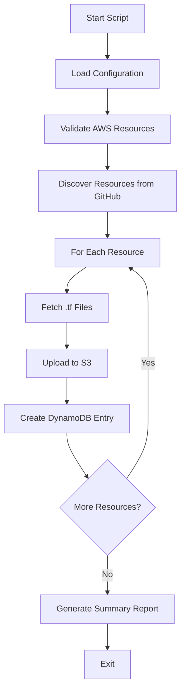

# Design Document: GitHub Examples Hydration

## Overview

The GitHub Examples Hydration feature provides a standalone Python script that imports validated AWSCC Terraform examples from the HashiCorp terraform-provider-awscc GitHub repository into the TANGO pipeline's AWS infrastructure. The script discovers resources via the GitHub API, downloads Terraform configuration files, uploads them to S3, and creates corresponding DynamoDB entries to enable intelligent resource selection by pipeline agents.

The design follows a sequential processing model where each resource is independently discovered, fetched, validated, and stored. This approach ensures partial failures don't cascade and allows for resumable operations.

## Architecture

### High-Level Flow



### Component Architecture

The system consists of four primary components:

1. **Configuration Manager**: Loads and validates AWS settings from config.py
2. **GitHub Client**: Handles API interactions, rate limiting, and file retrieval
3. **Storage Manager**: Manages S3 uploads and DynamoDB writes
4. **Orchestrator**: Coordinates the hydration workflow and error handling

### Data Flow

```
GitHub API → Resource List → GitHub Client → .tf File Content
                                                    ↓
                                            Storage Manager
                                                    ↓
                                    ┌───────────────┴───────────────┐
                                    ↓                               ↓
                            S3 Upload                      DynamoDB Write
                    (examples/resources/...)         (resource metadata)
```

## Components and Interfaces

### 1. Configuration Manager

**Purpose**: Load and validate configuration from config.py and command-line arguments

**Interface**:
```python
class HydrationConfig:
    aws_region: str
    s3_bucket: str
    dynamodb_table: str
    github_token: Optional[str]
    dry_run: bool
    resource_filter: Optional[str]
    
    @classmethod
    def from_config() -> HydrationConfig:
        """Load configuration from config.py and environment"""
        
    def validate(self) -> None:
        """Validate AWS resources are accessible"""
```

**Responsibilities**:
- Load AWS configuration from config.py
- Parse command-line arguments (--dry-run, --filter, --github-token)
- Validate S3 bucket and DynamoDB table exist and are accessible
- Provide configuration to other components

### 2. GitHub Client

**Purpose**: Interact with GitHub API to discover and fetch Terraform examples

**Interface**:
```python
class GitHubClient:
    def __init__(self, token: Optional[str] = None):
        """Initialize with optional authentication token"""
    
    def list_resource_directories(self) -> List[str]:
        """Fetch list of resource directories from examples/resources/"""
    
    def list_terraform_files(self, resource_name: str) -> List[str]:
        """List all .tf files for a given resource"""
    
    def fetch_file_content(self, resource_name: str, filename: str) -> str:
        """Download content of a specific .tf file"""
    
    def _handle_rate_limit(self, response: requests.Response) -> None:
        """Handle GitHub API rate limiting with exponential backoff"""
```

**Responsibilities**:
- Discover resource directories via GitHub API
- List .tf files for each resource
- Download file content with retry logic
- Handle rate limiting (authenticated and unauthenticated)
- Manage network errors with exponential backoff

**GitHub API Endpoints**:
- List directories: `GET /repos/hashicorp/terraform-provider-awscc/contents/examples/resources`
- List files: `GET /repos/hashicorp/terraform-provider-awscc/contents/examples/resources/{resource_name}`
- Fetch content: `GET /repos/hashicorp/terraform-provider-awscc/contents/examples/resources/{resource_name}/{filename}`

### 3. Storage Manager

**Purpose**: Handle S3 uploads and DynamoDB writes with error handling

**Interface**:
```python
class StorageManager:
    def __init__(self, s3_bucket: str, dynamodb_table: str, dry_run: bool = False):
        """Initialize with AWS resource names"""
    
    def upload_to_s3(self, resource_name: str, filename: str, content: str) -> str:
        """Upload .tf file to S3, returns S3 path"""
    
    def file_exists_in_s3(self, resource_name: str, filename: str) -> bool:
        """Check if file already exists in S3"""
    
    def create_dynamodb_entry(self, resource_name: str, s3_path: str) -> bool:
        """Create DynamoDB entry for imported resource"""
    
    def entry_exists_in_dynamodb(self, resource_name: str, source: str) -> bool:
        """Check if resource already has a hashicorp_github entry"""
```

**Responsibilities**:
- Upload Terraform files to S3 with correct path structure
- Check for existing S3 files to avoid duplicates
- Create DynamoDB entries with correct schema
- Check for existing DynamoDB entries to avoid duplicates
- Handle AWS API errors gracefully
- Support dry-run mode (log without executing)

**S3 Path Structure**:
```
s3://{bucket}/examples/resources/{resource_name}/{filename}.tf
```

**DynamoDB Schema**:
```python
{
    "resource_name": str,        # Partition key
    "timestamp": str,            # Sort key (ISO 8601 UTC)
    "status": "success",
    "source": "hashicorp_github",
    "s3_terraform_link": str     # S3 path to .tf file
}
```

### 4. Orchestrator

**Purpose**: Coordinate the hydration workflow and manage error handling

**Interface**:
```python
class HydrationOrchestrator:
    def __init__(self, config: HydrationConfig):
        """Initialize with configuration"""
    
    def run(self) -> HydrationReport:
        """Execute the complete hydration workflow"""
    
    def process_resource(self, resource_name: str) -> ResourceResult:
        """Process a single resource (fetch, upload, store)"""
    
    def generate_report(self, results: List[ResourceResult]) -> HydrationReport:
        """Generate summary report of hydration results"""
```

**Responsibilities**:
- Coordinate workflow across all components
- Process each resource independently
- Collect and aggregate results
- Generate summary report
- Handle top-level errors (configuration, AWS access)

## Data Models

### HydrationConfig
```python
@dataclass
class HydrationConfig:
    aws_region: str
    s3_bucket: str
    dynamodb_table: str
    github_token: Optional[str] = None
    dry_run: bool = False
    resource_filter: Optional[str] = None
```

### ResourceResult
```python
@dataclass
class ResourceResult:
    resource_name: str
    status: str  # "success", "failed", "skipped"
    files_processed: int
    files_uploaded: int
    dynamodb_entries_created: int
    error_message: Optional[str] = None
```

### HydrationReport
```python
@dataclass
class HydrationReport:
    total_resources: int
    successful: int
    failed: int
    skipped: int
    total_files_uploaded: int
    total_dynamodb_entries: int
    errors: List[str]
    duration_seconds: float
```

## Correctness Properties

*A property is a characteristic or behavior that should hold true across all valid executions of a system—essentially, a formal statement about what the system should do. Properties serve as the bridge between human-readable specifications and machine-verifiable correctness guarantees.*


### Property 1: Complete File Retrieval
*For any* resource with multiple .tf files, fetching that resource should retrieve all files while preserving their original filenames.
**Validates: Requirements 2.1, 2.2**

### Property 2: Retry Logic with Exponential Backoff
*For any* transient error (network failure, rate limit), the system should retry the operation with exponentially increasing delays, up to a maximum of 3 attempts before failing.
**Validates: Requirements 1.2, 1.5, 5.4**

### Property 3: Non-Empty File Validation
*For any* file content retrieved from GitHub, the system should validate it is non-empty before proceeding with storage operations.
**Validates: Requirements 2.4**

### Property 4: S3 Path Format Consistency
*For any* resource name and filename, the constructed S3 path should follow the format `examples/resources/{resource_name}/{filename}.tf`.
**Validates: Requirements 3.1, 8.3**

### Property 5: Resource Processing Isolation
*For any* error occurring during processing of a single resource (GitHub fetch, S3 upload, or DynamoDB write), the system should log the error and continue processing all remaining resources without interruption.
**Validates: Requirements 2.3, 3.3, 4.4, 5.1**

### Property 6: At Least One Successful Upload
*For any* resource with multiple .tf files, after processing all files, the system should verify that at least one file was successfully uploaded to S3 before creating DynamoDB entries.
**Validates: Requirements 3.5**

### Property 7: DynamoDB Schema Compliance
*For any* successfully uploaded resource file, the created DynamoDB entry should contain all required fields (resource_name as partition key, ISO 8601 UTC timestamp as sort key, status="success", source="hashicorp_github", s3_terraform_link) with correct data types and formats.
**Validates: Requirements 4.1, 4.2, 8.1, 8.2, 8.5**

### Property 8: Idempotent Operations
*For any* resource that has already been imported (exists in S3 and DynamoDB with source="hashicorp_github"), attempting to import it again should skip both S3 upload and DynamoDB write operations, logging the skip.
**Validates: Requirements 3.2, 4.3**

### Property 9: Dry-Run Mode Prevents Writes
*For any* operation when dry-run mode is enabled, the system should log all intended S3 uploads and DynamoDB writes without executing any actual AWS API calls.
**Validates: Requirements 3.4, 4.5, 6.5**

### Property 10: One DynamoDB Entry Per File
*For any* resource with multiple .tf files, the system should create exactly one DynamoDB entry for each successfully uploaded file, with each entry containing the correct s3_terraform_link for its corresponding file.
**Validates: Requirements 8.4**

### Property 11: Resource Filter Pattern Matching
*For any* resource filter pattern provided via command-line, the system should process only resources whose names match the pattern, skipping all non-matching resources.
**Validates: Requirements 7.3**

### Property 12: Comprehensive Logging
*For any* resource being processed, the system should log the resource name, current progress, and any errors with complete details (resource name, operation type, error message).
**Validates: Requirements 6.2, 6.4**

### Property 13: Summary Report Completeness
*For any* hydration execution, the generated summary report should contain accurate counts of total resources, successful imports, failures, skipped resources, total files uploaded, and total DynamoDB entries created.
**Validates: Requirements 6.3**

## Error Handling

### Error Categories

**1. Configuration Errors (Fail Fast)**
- Invalid AWS credentials → Exit immediately with clear error message
- Missing S3 bucket → Exit immediately with clear error message
- Missing DynamoDB table → Exit immediately with clear error message
- Invalid config.py → Exit immediately with clear error message

**2. GitHub API Errors (Retry with Backoff)**
- Rate limit exceeded → Wait for rate limit reset, retry with exponential backoff
- Network timeout → Retry up to 3 times with exponential backoff
- 5xx server errors → Retry up to 3 times with exponential backoff
- 404 not found → Log and skip the specific file, continue processing

**3. AWS Operation Errors (Log and Continue)**
- S3 upload failure → Log error with resource details, mark resource as failed, continue
- DynamoDB write failure → Log error with resource details, mark resource as failed, continue
- Throttling errors → Retry with exponential backoff up to 3 times

**4. Data Validation Errors (Log and Skip)**
- Empty file content → Log warning, skip file, continue with other files
- Invalid resource name → Log warning, skip resource, continue
- Malformed GitHub response → Log error, skip resource, continue

### Error Handling Strategy

```python
# Pseudo-code for error handling pattern
def process_resource(resource_name: str) -> ResourceResult:
    try:
        # Fetch files from GitHub (with retry logic)
        files = github_client.list_terraform_files(resource_name)
        
        uploaded_count = 0
        for filename in files:
            try:
                # Individual file processing with error isolation
                content = github_client.fetch_file_content(resource_name, filename)
                
                if not content.strip():
                    log_warning(f"Empty file: {resource_name}/{filename}")
                    continue
                
                s3_path = storage_manager.upload_to_s3(resource_name, filename, content)
                storage_manager.create_dynamodb_entry(resource_name, s3_path)
                uploaded_count += 1
                
            except S3Error as e:
                log_error(f"S3 upload failed for {resource_name}/{filename}: {e}")
                continue
            except DynamoDBError as e:
                log_error(f"DynamoDB write failed for {resource_name}/{filename}: {e}")
                continue
        
        if uploaded_count == 0:
            return ResourceResult(resource_name, "failed", len(files), 0, 0, "No files uploaded")
        
        return ResourceResult(resource_name, "success", len(files), uploaded_count, uploaded_count)
        
    except GitHubError as e:
        log_error(f"GitHub fetch failed for {resource_name}: {e}")
        return ResourceResult(resource_name, "failed", 0, 0, 0, str(e))
```

### Retry Logic

Exponential backoff with jitter for transient errors:

```python
def retry_with_backoff(operation, max_attempts=3):
    base_delay = 1.0  # seconds
    max_delay = 60.0  # seconds
    
    for attempt in range(max_attempts):
        try:
            return operation()
        except TransientError as e:
            if attempt == max_attempts - 1:
                raise
            
            delay = min(base_delay * (2 ** attempt), max_delay)
            jitter = random.uniform(0, delay * 0.1)
            time.sleep(delay + jitter)
            
            log_info(f"Retry {attempt + 1}/{max_attempts} after {delay:.1f}s")
```

## Testing Strategy

Since this is a one-time hydration effort, formal automated testing is not required. Instead, the implementation will focus on:

### Manual Verification

- **Dry-run mode**: Test the script with `--dry-run` flag to preview operations without making changes
- **Small batch testing**: Test with `--filter` flag on a small subset of resources (e.g., `--filter awscc_s3_*`)
- **AWS Console verification**: Manually verify S3 uploads and DynamoDB entries after execution
- **Log review**: Review detailed logs to ensure all resources were processed correctly

### Validation Approach

1. Run with `--dry-run` to verify logic without AWS writes
2. Run with `--filter awscc_s3_bucket` to test a single resource
3. Verify the resource appears in S3 and DynamoDB
4. Run full hydration and review summary report
5. Spot-check random resources in AWS Console

### Error Handling Verification

The script will include comprehensive logging and error reporting to enable manual verification:
- Log each resource processed with success/failure status
- Generate summary report with counts and error details
- Exit with non-zero status code if critical errors occur

## Implementation Notes

### GitHub API Rate Limits

- **Unauthenticated**: 60 requests/hour
- **Authenticated**: 5,000 requests/hour
- Rate limit headers: `X-RateLimit-Remaining`, `X-RateLimit-Reset`
- Strategy: Check headers after each request, sleep until reset if exhausted

### Performance Considerations

- Process resources sequentially (simpler error handling, easier to resume)
- Use boto3 client connection pooling for AWS operations
- Cache GitHub API responses where appropriate (resource list)
- Estimated time: ~2-3 minutes for 100+ resources (with authentication)

### Resumability

The design naturally supports resumability:
- Check S3 and DynamoDB before processing each resource
- Skip resources that already exist
- Can be run multiple times safely (idempotent)
- No state file needed

### Future Enhancements

- Parallel processing with thread pool (faster but more complex error handling)
- Continuous sync mode (watch for new releases)
- Validation of imported examples (terraform validate)
- Diff detection (only update changed files)
