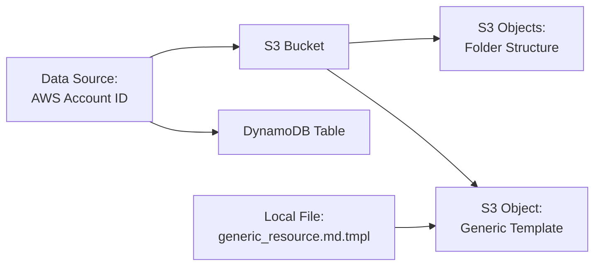

# Design Document: TANGO Terraform Infrastructure

## Overview

This design document describes the Terraform module that automates the provisioning of AWS infrastructure for the TANGO Multi-Agent Pipeline. The module creates a DynamoDB table for state tracking, an S3 bucket for storing configurations and reports, and ensures all resources follow AWS security best practices.

The module is designed to be:
- **Idempotent**: Can be applied multiple times safely
- **Configurable**: Supports customization through input variables
- **Secure**: Implements AWS security best practices by default
- **Documented**: Provides clear outputs for application configuration

## Architecture

### High-Level Architecture

```mermaid
graph TB
    subgraph "Terraform Module"
        TF[Terraform Configuration]
    end
    
    subgraph "AWS Resources"
        DDB[DynamoDB Table<br/>tango-pipeline-state]
        S3[S3 Bucket<br/>tango-project-docs-{account-id}]
        TMPL[Generic Template<br/>generic_resource.md.tmpl]
    end
    
    subgraph "TANGO Pipeline"
        APP[Python Application]
    end
    
    TF -->|Creates| DDB
    TF -->|Creates| S3
    TF -->|Uploads| TMPL
    S3 -->|Contains| TMPL
    
    APP -->|Reads/Writes| DDB
    APP -->|Reads/Writes| S3
    
    TF -->|Outputs| OUTPUTS[Configuration Values]
    OUTPUTS -->|Configures| APP
```

### Module Structure

The Terraform module will follow standard Terraform module conventions:

```
terraform/
├── main.tf           # Main resource definitions
├── variables.tf      # Input variable declarations
├── outputs.tf        # Output value declarations
├── versions.tf       # Terraform and provider version constraints
├── README.md         # Module documentation
└── examples/
    └── basic/
        ├── main.tf   # Example usage
        └── README.md # Example documentation
```

### Resource Dependencies



## Components and Interfaces

### 1. DynamoDB Table Resource

**Purpose**: Provides persistent state tracking for the pipeline to record which resources have been processed.

**Configuration**:
```hcl
resource "aws_dynamodb_table" "pipeline_state" {
  name           = var.dynamodb_table_name
  billing_mode   = "PAY_PER_REQUEST"
  hash_key       = "resource_name"
  range_key      = "timestamp"
  
  attribute {
    name = "resource_name"
    type = "S"
  }
  
  attribute {
    name = "timestamp"
    type = "N"
  }
  
  point_in_time_recovery {
    enabled = var.enable_point_in_time_recovery
  }
  
  tags = merge(
    var.tags,
    {
      Name = var.dynamodb_table_name
      ManagedBy = "Terraform"
    }
  )
}
```

**Key Attributes**:
- `name`: Configurable table name (default: `tango-pipeline-state`)
- `billing_mode`: PAY_PER_REQUEST for cost optimization
- `hash_key`: `resource_name` (String) - identifies the resource
- `range_key`: `timestamp` (Number) - tracks when the resource was processed
- `point_in_time_recovery`: Enabled for data protection

### 2. S3 Bucket Resource

**Purpose**: Provides object storage for Terraform configurations, templates, and analysis reports.

**Configuration**:
```hcl
data "aws_caller_identity" "current" {}

resource "aws_s3_bucket" "project_docs" {
  bucket = "${var.s3_bucket_prefix}-${data.aws_caller_identity.current.account_id}"
  
  tags = merge(
    var.tags,
    {
      Name = "${var.s3_bucket_prefix}-${data.aws_caller_identity.current.account_id}"
      ManagedBy = "Terraform"
    }
  )
}

resource "aws_s3_bucket_versioning" "project_docs" {
  bucket = aws_s3_bucket.project_docs.id
  
  versioning_configuration {
    status = "Enabled"
  }
}

resource "aws_s3_bucket_server_side_encryption_configuration" "project_docs" {
  bucket = aws_s3_bucket.project_docs.id
  
  rule {
    apply_server_side_encryption_by_default {
      sse_algorithm     = var.encryption_type
      kms_master_key_id = var.encryption_type == "aws:kms" ? var.kms_key_id : null
    }
  }
}

resource "aws_s3_bucket_public_access_block" "project_docs" {
  bucket = aws_s3_bucket.project_docs.id
  
  block_public_acls       = true
  block_public_policy     = true
  ignore_public_acls      = true
  restrict_public_buckets = true
}
```

**Key Attributes**:
- `bucket`: Globally unique name using account ID suffix
- `versioning`: Enabled for safety and rollback capability
- `encryption`: AES256 or KMS encryption
- `public_access_block`: All public access blocked

### 3. S3 Folder Structure

**Purpose**: Creates the required folder structure for organizing pipeline artifacts.

**Configuration**:
```hcl
resource "aws_s3_object" "folders" {
  for_each = toset([
    "templates/resources/",
    "examples/resources/",
    "failed/resources/",
    "analysis/resource/"
  ])
  
  bucket       = aws_s3_bucket.project_docs.id
  key          = each.value
  content_type = "application/x-directory"
  
  tags = var.tags
}
```

**Folder Structure**:
- `templates/resources/`: Stores resource template files
- `examples/resources/`: Stores example configurations
- `failed/resources/`: Stores configurations that failed validation
- `analysis/resource/`: Stores analysis reports

### 4. Generic Template Upload

**Purpose**: Uploads the critical generic resource template file that the storage agent reads.

**Configuration**:
```hcl
resource "aws_s3_object" "generic_template" {
  bucket       = aws_s3_bucket.project_docs.id
  key          = "templates/resources/generic_resource.md.tmpl"
  source       = "${path.module}/templates/resources/generic_resource.md.tmpl"
  etag         = filemd5("${path.module}/templates/resources/generic_resource.md.tmpl")
  content_type = "text/plain"
  
  tags = merge(
    var.tags,
    {
      Name = "generic_resource_template"
      Critical = "true"
    }
  )
}
```

**Key Attributes**:
- `source`: Reads from local file in module directory
- `etag`: Ensures file is re-uploaded if content changes
- `content_type`: Set to text/plain for template files

### 5. Input Variables

**Purpose**: Provides configuration flexibility for different environments.

**Variables**:
```hcl
variable "dynamodb_table_name" {
  description = "Name of the DynamoDB table for pipeline state tracking"
  type        = string
  default     = "tango-pipeline-state"
}

variable "s3_bucket_prefix" {
  description = "Prefix for the S3 bucket name (account ID will be appended)"
  type        = string
  default     = "tango-project-docs"
}

variable "aws_region" {
  description = "AWS region where resources will be created"
  type        = string
  default     = "us-west-2"
}

variable "encryption_type" {
  description = "Type of encryption for S3 bucket (AES256 or aws:kms)"
  type        = string
  default     = "AES256"
  
  validation {
    condition     = contains(["AES256", "aws:kms"], var.encryption_type)
    error_message = "Encryption type must be either AES256 or aws:kms"
  }
}

variable "kms_key_id" {
  description = "KMS key ID for S3 encryption (required if encryption_type is aws:kms)"
  type        = string
  default     = null
}

variable "enable_point_in_time_recovery" {
  description = "Enable point-in-time recovery for DynamoDB table"
  type        = bool
  default     = true
}

variable "force_destroy_bucket" {
  description = "Allow destruction of S3 bucket even if it contains objects"
  type        = bool
  default     = false
}

variable "tags" {
  description = "Common tags to apply to all resources"
  type        = map(string)
  default     = {}
}
```

### 6. Output Values

**Purpose**: Provides resource identifiers for configuring the Python application.

**Outputs**:
```hcl
output "dynamodb_table_name" {
  description = "Name of the DynamoDB table"
  value       = aws_dynamodb_table.pipeline_state.name
}

output "dynamodb_table_arn" {
  description = "ARN of the DynamoDB table"
  value       = aws_dynamodb_table.pipeline_state.arn
}

output "s3_bucket_name" {
  description = "Name of the S3 bucket"
  value       = aws_s3_bucket.project_docs.id
}

output "s3_bucket_arn" {
  description = "ARN of the S3 bucket"
  value       = aws_s3_bucket.project_docs.arn
}

output "aws_region" {
  description = "AWS region where resources were created"
  value       = var.aws_region
}

output "generic_template_path" {
  description = "S3 path to the generic resource template"
  value       = "s3://${aws_s3_bucket.project_docs.id}/${aws_s3_object.generic_template.key}"
}
```

## Data Models

### DynamoDB Table Schema

**Table Name**: `tango-pipeline-state` (configurable)

**Primary Key**:
- Partition Key: `resource_name` (String) - The name of the AWSCC resource being tracked
- Sort Key: `timestamp` (Number) - Unix timestamp when the resource was processed

**Attributes** (example):
```json
{
  "resource_name": "awscc_s3_bucket",
  "timestamp": 1704067200,
  "status": "completed",
  "validation_result": "passed",
  "error_message": null,
  "processed_by": "agent-1"
}
```

**Access Patterns**:
1. Query all records for a specific resource: Query by `resource_name`
2. Get latest record for a resource: Query by `resource_name` with descending sort on `timestamp`
3. Scan all processed resources: Scan operation
4. Delete old records: DeleteItem by primary key

### S3 Bucket Structure

**Bucket Name**: `{prefix}-{account-id}` (e.g., `tango-project-docs-123456789012`)

**Folder Structure**:
```
s3://tango-project-docs-{account-id}/
├── templates/
│   └── resources/
│       ├── generic_resource.md.tmpl  (critical file)
│       └── {resource-name}.md.tmpl
├── examples/
│   └── resources/
│       └── {resource-name}/
│           └── example.tf
├── failed/
│   └── resources/
│       └── {resource-name}/
│           └── {timestamp}.tf
└── analysis/
    └── resource/
        └── {resource-name}/
            └── {timestamp}-report.json
```

**Object Metadata**:
- All objects have encryption enabled
- Versioning enabled for rollback capability
- Tags applied for resource tracking

### Terraform State

The module itself does not manage Terraform state location. Users must configure their backend separately:

**Example Backend Configuration**:
```hcl
terraform {
  backend "s3" {
    bucket = "my-terraform-state"
    key    = "tango/infrastructure/terraform.tfstate"
    region = "us-west-2"
  }
}
```

## Validation

The module will be validated through manual testing:

1. **Apply Test**: Run `terraform apply` and verify all resources are created correctly
2. **Output Test**: Verify all outputs contain expected values  
3. **Configuration Test**: Test with different variable configurations
4. **Destroy Test**: Run `terraform destroy` and verify all resources are removed
5. **Idempotency Test**: Run `terraform apply` multiple times and verify no changes
6. **Documentation Test**: Verify README is complete and examples work

## Error Handling

### Terraform Validation Errors

**Missing Source File**:
- **Scenario**: The local generic template file does not exist
- **Handling**: Terraform will fail during plan/apply with a clear error message indicating the missing file path
- **User Action**: User must ensure the template file exists at the expected location before applying

**Invalid Variable Values**:
- **Scenario**: User provides invalid encryption type or other constrained variables
- **Handling**: Terraform validation blocks will catch invalid values during plan phase
- **Error Message**: Clear message indicating valid options
- **User Action**: User must provide valid values as specified in variable validation

**Bucket Name Conflicts**:
- **Scenario**: S3 bucket with the generated name already exists in another account
- **Handling**: AWS API will return error during bucket creation
- **Error Message**: Bucket name already exists
- **User Action**: User must choose a different bucket prefix

### AWS API Errors

**Insufficient Permissions**:
- **Scenario**: User lacks required IAM permissions to create resources
- **Handling**: AWS API returns permission denied errors
- **Error Message**: Specific permission that is missing
- **User Action**: User must ensure they have required IAM permissions (documented in README)

**Resource Limits**:
- **Scenario**: Account has reached service limits (e.g., max DynamoDB tables)
- **Handling**: AWS API returns limit exceeded error
- **Error Message**: Specific limit that was exceeded
- **User Action**: User must request limit increase or clean up existing resources

**Region Availability**:
- **Scenario**: Specified region does not support required services
- **Handling**: AWS API returns service not available error
- **Error Message**: Service not available in region
- **User Action**: User must choose a different region

### State Management Errors

**State Lock Conflicts**:
- **Scenario**: Another Terraform operation is in progress
- **Handling**: Terraform state locking prevents concurrent modifications
- **Error Message**: State is locked by another operation
- **User Action**: Wait for other operation to complete or force unlock if stale

**State Drift**:
- **Scenario**: Resources were modified outside of Terraform
- **Handling**: Terraform detects drift during plan and shows differences
- **Error Message**: Resource has been modified outside Terraform
- **User Action**: User can import changes or allow Terraform to correct drift

### Destroy Errors

**Bucket Not Empty**:
- **Scenario**: Attempting to destroy S3 bucket containing objects without force_destroy
- **Handling**: AWS API prevents bucket deletion
- **Error Message**: Bucket must be empty before deletion
- **User Action**: Set force_destroy = true or manually empty bucket

**Resource Dependencies**:
- **Scenario**: External resources depend on Terraform-managed resources
- **Handling**: AWS API prevents deletion due to dependencies
- **Error Message**: Resource has dependent resources
- **User Action**: Remove dependencies before destroying

## Security Considerations

### Encryption

**S3 Bucket Encryption**:
- Default: AES256 (AWS-managed keys)
- Optional: KMS (customer-managed keys for additional control)
- All objects encrypted at rest
- Encryption cannot be disabled

**DynamoDB Encryption**:
- AWS-managed encryption enabled by default
- Data encrypted at rest
- Encryption in transit via HTTPS

### Access Control

**S3 Public Access**:
- All public access blocked by default
- Cannot be overridden without modifying module
- Prevents accidental data exposure

**IAM Permissions**:
- Module does not create IAM roles/policies
- Users must have pre-existing permissions
- Documentation specifies minimum required permissions
- Principle of least privilege recommended

### Data Protection

**Versioning**:
- S3 versioning enabled for rollback capability
- Protects against accidental deletion
- Allows recovery of previous versions

**Point-in-Time Recovery**:
- DynamoDB PITR enabled by default
- Allows recovery to any point in last 35 days
- Protects against accidental data loss

**Backup Strategy**:
- S3 versioning provides object-level backup
- DynamoDB PITR provides table-level backup
- Users should implement additional backup for critical data

### Compliance

**Data Residency**:
- Resources created in specified region only
- No cross-region replication by default
- Users control data location

**Audit Trail**:
- All resources tagged with ManagedBy = Terraform
- CloudTrail logs all API calls
- S3 access logging can be enabled separately

## Performance Considerations

### Cost Optimization

**DynamoDB**:
- PAY_PER_REQUEST billing mode
- No cost when idle
- Scales automatically with usage
- Cost-effective for variable workloads

**S3**:
- Standard storage class
- Consider lifecycle policies for old data
- Versioning increases storage costs
- Monitor storage usage

**Data Transfer**:
- Minimize cross-region transfers
- Use VPC endpoints to avoid data transfer costs
- Keep pipeline and resources in same region

### Scalability

**DynamoDB**:
- Automatic scaling with PAY_PER_REQUEST
- No capacity planning required
- Handles variable workloads
- Consider provisioned capacity for predictable high-volume workloads

**S3**:
- Unlimited storage capacity
- Automatic scaling
- High availability and durability
- Consider S3 Intelligent-Tiering for cost optimization

### Monitoring

**CloudWatch Metrics**:
- DynamoDB: ConsumedReadCapacityUnits, ConsumedWriteCapacityUnits
- S3: BucketSizeBytes, NumberOfObjects
- Set up alarms for unusual activity

**Cost Monitoring**:
- Use AWS Cost Explorer
- Set up billing alarms
- Tag resources for cost allocation

## Deployment

### Prerequisites

**Required Tools**:
- Terraform >= 1.0
- AWS CLI configured
- Valid AWS credentials

**Required Permissions**:
Users must have IAM permissions to:
- Create/delete DynamoDB tables
- Create/delete S3 buckets
- Upload S3 objects
- Create/delete S3 bucket policies
- Read AWS account information

### Deployment Steps

1. **Clone Repository**:
```bash
git clone <repository-url>
cd terraform/
```

2. **Initialize Terraform**:
```bash
terraform init
```

3. **Review Plan**:
```bash
terraform plan
```

4. **Apply Configuration**:
```bash
terraform apply
```

5. **Save Outputs**:
```bash
terraform output -json > outputs.json
```

6. **Configure Python Application**:
```bash
export DYNAMODB_TABLE=$(terraform output -raw dynamodb_table_name)
export S3_BUCKET=$(terraform output -raw s3_bucket_name)
export AWS_REGION=$(terraform output -raw aws_region)
```

### Configuration Examples

**Basic Usage**:
```hcl
module "tango_infrastructure" {
  source = "./terraform"
}
```

**Custom Configuration**:
```hcl
module "tango_infrastructure" {
  source = "./terraform"
  
  dynamodb_table_name = "my-pipeline-state"
  s3_bucket_prefix    = "my-project-docs"
  aws_region          = "us-east-1"
  
  tags = {
    Environment = "production"
    Project     = "TANGO"
  }
}
```

**KMS Encryption**:
```hcl
module "tango_infrastructure" {
  source = "./terraform"
  
  encryption_type = "aws:kms"
  kms_key_id      = "KMS ARN HERE"
}
```

### Updating Infrastructure

To update existing infrastructure:

1. Modify variables in configuration
2. Run `terraform plan` to review changes
3. Run `terraform apply` to apply changes
4. Terraform will update resources in place when possible

### Destroying Infrastructure

To remove all infrastructure:

```bash
# Review what will be destroyed
terraform plan -destroy

# Destroy all resources
terraform destroy
```

**Note**: If S3 bucket contains objects and `force_destroy = false`, you must either:
- Set `force_destroy = true` and re-apply before destroying
- Manually empty the bucket before destroying

## Maintenance

### Updating the Module

**Version Constraints**:
- Pin Terraform version in `versions.tf`
- Pin AWS provider version
- Test updates in non-production environment first

**Backward Compatibility**:
- Avoid breaking changes to variable names
- Deprecate old variables before removing
- Document migration path for breaking changes

### Monitoring and Alerts

**Recommended CloudWatch Alarms**:
- DynamoDB throttling events
- S3 bucket size exceeds threshold
- Unusual API call patterns
- Cost exceeds budget

### Troubleshooting

**Common Issues**:

1. **Bucket name already exists**:
   - Change `s3_bucket_prefix` variable
   - Bucket names must be globally unique

2. **Permission denied errors**:
   - Verify IAM permissions
   - Check AWS credentials configuration
   - Review CloudTrail logs for specific denied actions

3. **State lock timeout**:
   - Check for other running Terraform operations
   - Force unlock if lock is stale: `terraform force-unlock <lock-id>`

4. **Template file not found**:
   - Verify file exists at `templates/resources/generic_resource.md.tmpl`
   - Check file path is relative to module root

## Future Enhancements

### Potential Improvements

1. **Multi-Environment Support**:
   - Workspace-based configuration
   - Environment-specific variable files
   - Separate state files per environment

2. **Enhanced Monitoring**:
   - CloudWatch dashboard creation
   - Automated alarm configuration
   - SNS notifications for alerts

3. **Backup Automation**:
   - Automated DynamoDB backups
   - S3 cross-region replication
   - Backup retention policies

4. **Cost Optimization**:
   - S3 lifecycle policies
   - Intelligent tiering
   - Reserved capacity for predictable workloads

5. **Security Enhancements**:
   - VPC endpoints for private access
   - S3 access logging
   - AWS Config rules for compliance

6. **CI/CD Integration**:
   - Automated testing pipeline
   - Automated deployment
   - Drift detection

### Extensibility

The module is designed to be extended with:
- Additional S3 buckets for different purposes
- Additional DynamoDB tables for different data
- CloudWatch dashboards and alarms
- Lambda functions for automation
- EventBridge rules for event-driven workflows
